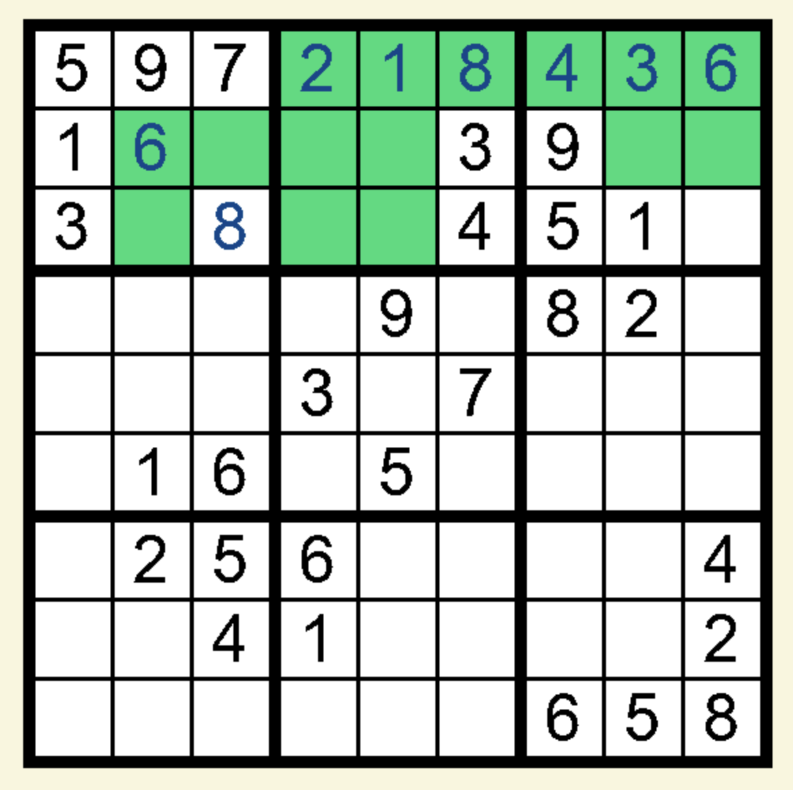

# Sudoku-Solver
Purpose: Allows the user to play sudoku or to see the recursive backtracking solution visualized

## Empty Board

 

## Board in Use

 

## Computer Solve

 

# Important Keys:

- Escape - Exit
- Shift - Annotation mode
- Enter - Computer Solve

# What I Learned:
- GUI creation
- Implementing recursive backtracking
